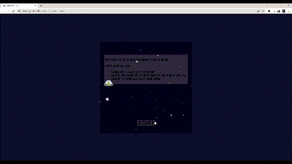
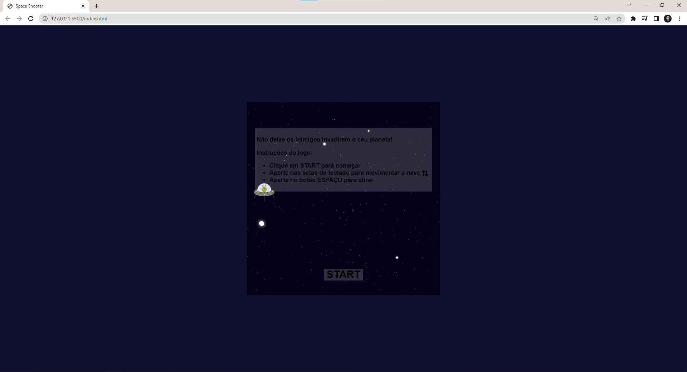
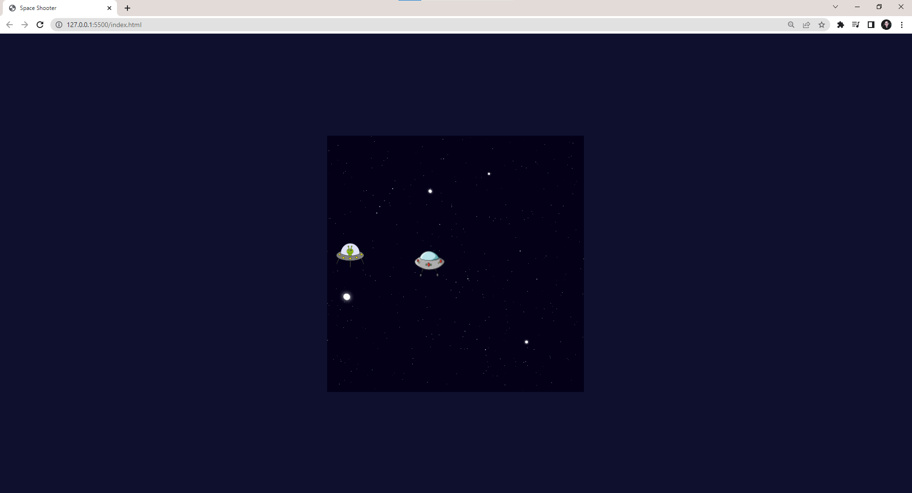

# Jogo Space Shooter
Projeto desenvolvido na plataforma DIO, com a finalidade de estudar HTML, CSS e Javascript.

Clique <a href="https://isabellacpmelo.github.io/jogo-space-shooter/">aqui</a> para acessar o projeto.

<a href="https://isabellacpmelo.github.io/jogo-space-shooter/"> 

## Ferramentas utilizadas:
* HTML5
* CSS3
* Javascript

## Print do Projeto
  
### Inicio jogo

  
### Layout do Jogo

